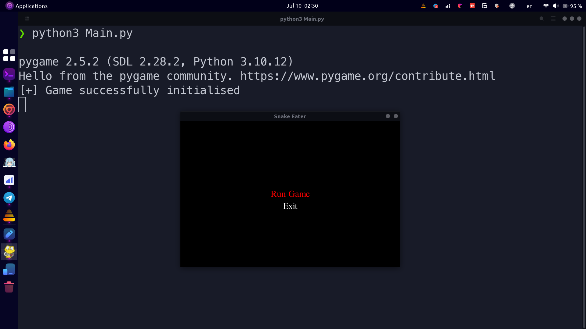
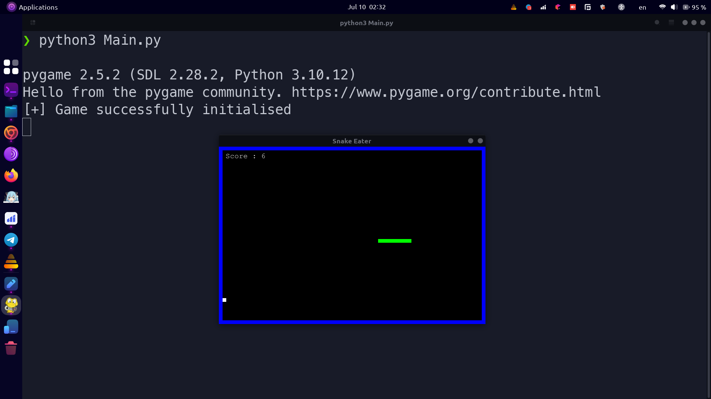
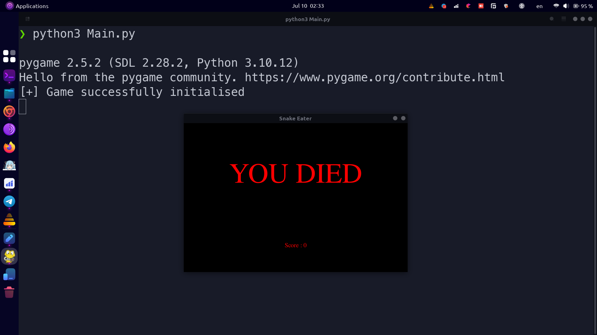

# Snake Eater

A classic Snake game implemented in Python using Pygame. Navigate the snake to eat food, grow longer, and avoid collisions with the walls or itself. The game includes a main menu, adjustable difficulty settings, and a game-over screen.

## Features

- **Menu**: Navigate through the game menu to start the game or exit.
- **Adjustable Difficulty**: Change the game's speed by adjusting the difficulty setting.
- **Game Over Screen**: Displays a game-over message and the player's score.

## Installation

1. **Clone the repository:**

    ```bash
    git clone https://github.com/Esmail-sarhadi/classic-Snake-game-py.git
    cd snake-eater
    ```

2. **Install Pygame:**

    Make sure you have Python installed on your system. Then, install Pygame using pip:

    ```bash
    pip install pygame
    ```

## How to Play

1. **Run the game:**

    ```bash
    python snake_game.py
    ```

2. **Controls:**

    - **Arrow keys or WASD**: Control the direction of the snake.
    - **ESC**: Quit the game.

3. **Objective:**

    - Guide the snake to eat the food, which appears at random positions on the screen.
    - Each time the snake eats food, it grows longer, and the score increases.
    - Avoid running into the walls or the snake's own body.

## Screenshots





## Contributing

Contributions are welcome! If you have suggestions for improvements or find bugs, please open an issue or submit a pull request.

## License

This project is licensed under the MIT License.

## Acknowledgements

- Inspired by the classic Snake game.
- Built using [Pygame](https://www.pygame.org/).

---

Feel free to customize this README file according to your needs. Happy coding!
<p>If you find this project helpful, consider making a donation:</p>
<p><a href="https://nowpayments.io/donation?api_key=REWCYVC-A1AMFK3-QNRS663-PKJSBD2&source=lk_donation&medium=referral" target="_blank">
     
</a></p>

